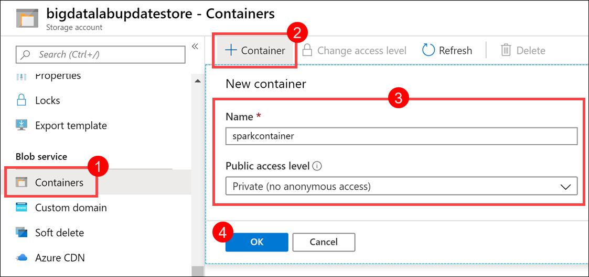
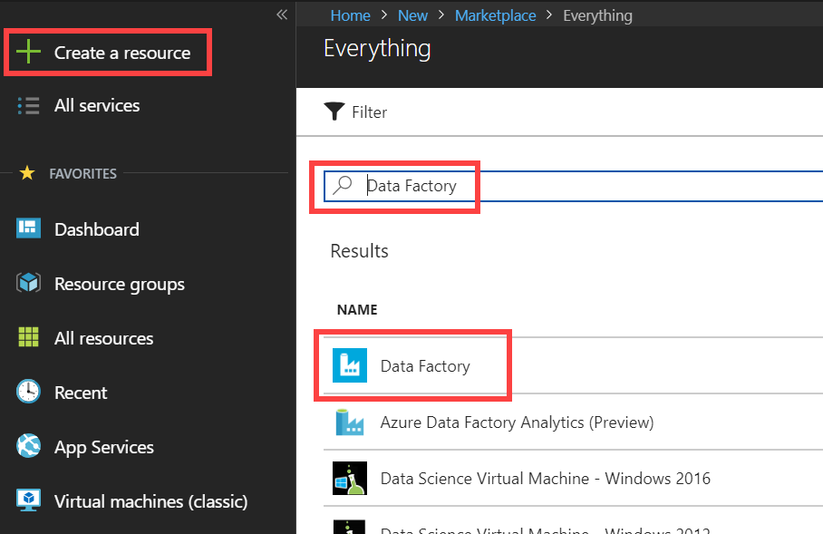
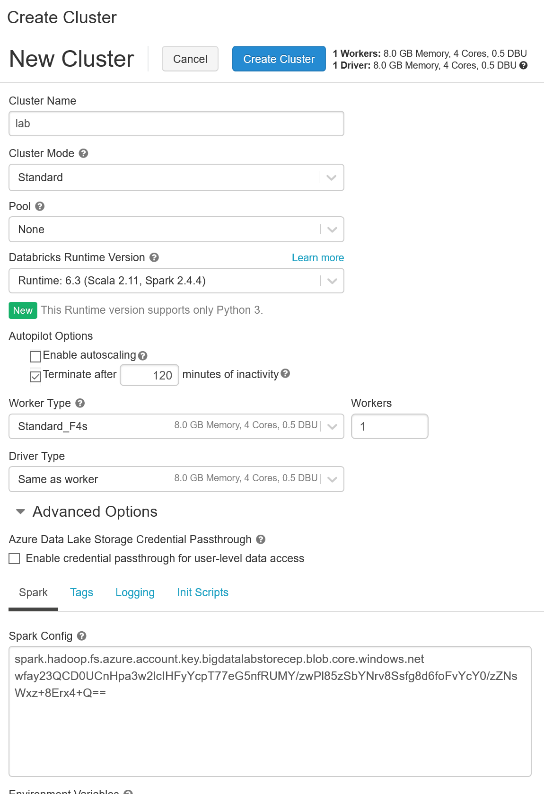

Big data and visualization

    

Before the hands-on lab setup guide 

August 2018

Information in this document, including URL and other Internet Web site references, is subject to change without notice. Unless otherwise noted, the example companies, organizations, products, domain names, e-mail addresses, logos, people, places, and events depicted herein are fictitious, and no association with any real company, organization, product, domain name, e-mail address, logo, person, place or event is intended or should be inferred. Complying with all applicable copyright laws is the responsibility of the user. Without limiting the rights under copyright, no part of this document may be reproduced, stored in or introduced into a retrieval system, or transmitted in any form or by any means (electronic, mechanical, photocopying, recording, or otherwise), or for any purpose, without the express written permission of Microsoft Corporation.

Microsoft may have patents, patent applications, trademarks, copyrights, or other intellectual property rights covering subject matter in this document. Except as expressly provided in any written license agreement from Microsoft, the furnishing of this document does not give you any license to these patents, trademarks, copyrights, or other intellectual property.

The names of manufacturers, products, or URLs are provided for informational purposes only and Microsoft makes no representations and warranties, either expressed, implied, or statutory, regarding these manufacturers or the use of the products with any Microsoft technologies. The inclusion of a manufacturer or product does not imply endorsement of Microsoft of the manufacturer or product. Links may be provided to third party sites. Such sites are not under the control of Microsoft and Microsoft is not responsible for the contents of any linked site or any link contained in a linked site, or any changes or updates to such sites. Microsoft is not responsible for webcasting or any other form of transmission received from any linked site. Microsoft is providing these links to you only as a convenience, and the inclusion of any link does not imply endorsement of Microsoft of the site or the products contained therein.

© 2018 Microsoft Corporation. All rights reserved.

## Requirements

1.  Microsoft Azure subscription must be pay-as-you-go or MSDN

    a. Trial subscriptions will not work

## Before the hands-on lab

Duration: 60 minutes

In this exercise, you will set up your environment for use in the rest of the hands-on lab. You should follow all the steps provided in the Before the Hands-on Lab section to prepare your environment _before_ attending the hands-on lab.

### Task 1: Deploy Data Science Virtual Machine (DSVM) cluster to Azure

1.  In the [Azure Portal](https://portal.azure.com) (https://portal.azure.com), select **+ Create a resource**, then type "DSVM" into the search bar. Select Data Science Virtual Machine - Windows 2016 from the results.

    

2.  Select Create on the bottom of the blade that follows

    

    Set the following configuration on the Basics tab:

    - Name: Enter **LabDSVM**

    - VM disk type: Select **SSD**

    - User name: Enter **demouser**

    - Password: Enter **Password.1!!**

    - Subscription: Select the subscription you are using for this hands-on lab

    - Resource Group: Select Create new, and enter **hands-on-lab** as the name of the new resource group

    - Location: Select a region close to you

    

3.  Select **OK** to move to the next step

4.  On the Choose a size blade, select an F8s size, or another one with at least 8 VCPUs and 16 GB RAM

    

5.  Choose **Select** to move on to the Settings blade

6.  Accept all the default values on the Settings blade, and select **OK**

7.  Select Create on the Create blade to provision the virtual machine

    

8.  It may take 10+ minutes for the virtual machine to complete provisioning. In the meantime, you can move on to the next task, while this deployment is ongoing.

### Task 2: Register for a trial API account at darksky.net

To retrieve the 7-day hourly weather forecast, you will use an API from darksky.net. There is a free trial version that provides you access to the API you need for this hands-on lab.

1.  Navigate to <https://darksky.net/dev>
2.  Select TRY FOR FREE

    

3.  Complete the Register form by providing your email address and a password. Select REGISTER.

    

4.  Check your email account you used for registration. You should have a confirmation email from Dark Sky. Open the email and follow the confirmation link within to complete the registration process. When the welcome page loads, log in with your new account.

    

5.  After logging in, you will be directed to the Your Account page. Take note of your **Secret Key** and copy it to a text editor such as Notepad for later. You will need this key to make API calls later in the lab.

    

6.  To verify that your API Key is working, follow the link on the bottom of the page located underneath Sample API Call. You should see a JSON result that looks similar to the following:

    

### Task 3: Provision Azure Databricks

Azure Databricks is an Apache Spark-based analytics platform optimized for Azure. It will be used in this lab to build and train a machine learning model used to predict flight delays.

1.  In the [Azure Portal](https://portal.azure.com) (https://portal.azure.com), select **+ Create a resource**, then type "Azure Databricks" into the search bar. Select Azure Databricks from the results.

    

2.  Select Create on the bottom of the blade that follows

3.  Set the following configuration on the Azure Databricks Service creation form:

    - Name: Enter a unique name as indicated by a green checkmark

    - Subscription: Select the subscription you are using for this hands-on lab

    - Resource Group: Select the same resource group you created at the beginning of this lab

    - Location: Select a region close to you

    - Pricing: Select Premium

    

4.  Select **Create** to finish and submit

### Task 4: Create Azure Storage account

Create a new Azure Storage account that will be used to store historic and scored flight and weather data sets for the lab.

1.  In the [Azure Portal](https://portal.azure.com) (https://portal.azure.com), select **+ Create a resource**, then type "storage" into the search bar. Select **Storage account - blob, file, table, queue** from the results.

    

2.  Select Create on the bottom of the blade that follows

3.  Set the following configuration on the Azure Databricks Service creation form:

    - Name: Enter a unique name as indicated by a green checkmark

    - Deployment model: Resource manager

    - Account kind: Blob storage

    - Location: Select the same region you used for Azure Databricks

    - Replication: Read-access geo-redundant storage (RA-GRS)

    - Performance: Standard

    - Access tier: Hot

    - Secure transfer required: Disabled

    - Subscription: Select the subscription you are using for this hands-on lab

    - Resource Group: Select the same resource group you created at the beginning of this lab

    - Virtual networks: Disabled

    

4.  Select **Create** to finish and submit

### Task 5: Retrieve Azure Storage account information and create container

You will need to have the Azure Storage account name and access key when you create your Azure Databricks cluster during the lab. You will also need to create storage containers in which you will store your flight and weather data files.

1.  From the side menu in the Azure portal, choose **Resource groups**, then enter your resource group name into the filter box, and select it from the list

2.  Next, select your lab Azure Storage account from the list

    

3.  Select **Access keys** (1) from the menu. Copy the **storage account name** (2) and the **key1** key (3) and copy the values to a text editor such as Notepad for later.

    

4.  Select **Containers** (1) from the menu. Select **+ Container** (2) on the Containers blade, enter **sparkcontainer** for the name (3), leaving the public access level set to Private. Select **OK** (4) to create the container. Please note: in some cases, you will not see Containers in the menu. Instead, select "Browse Blobs" underneath the Blob Service heading.

    

### Task 6: Provision Azure Data Factory

Create a new Azure Data Factory instance that will be used to orchestrate data transfers for analysis.

1.  In the [Azure Portal](https://portal.azure.com) (https://portal.azure.com), select **+ Create a resource**, then type "Data Factory" into the search bar. Select **Data Factory** from the results.

    

2.  Select Create on the bottom of the blade that follows

3.  Set the following configuration on the Data Factory creation form:

    - Name: Enter a unique name as indicated by a green checkmark

    - Deployment model: Resource manager

    - Subscription: Select the subscription you are using for this hands-on lab

    - Resource Group: Select the same resource group you created at the beginning of this lab

    - Version: V2

    - Location: Select the same region you used for Azure Databricks

    

4.  Select **Create** to finish and submit

### Task 7: Initialize Azure Machine Learning Workbench on the Lab DSVM

Before using the Azure Machine Learning Workbench on the Data Science VM, you will need to take the one-time action of double-clicking on the AzureML Workbench Setup icon on the desktop to install your instance of the workbench.

1.  Connect to the Lab DSVM (If you are already connected to your DSVM, skip to Step 8)

2.  From the side menu in the Azure portal, select **Resource groups**, then enter your resource group name into the filter box, and select it from the list

3.  Next, select your lab Data Science Virtual Machine (DSVM) from the list

    

4.  On your Lab DSVM blade, select **Connect** from the top menu

    

5.  In the dialog that appears, accept the defaults and select **Download RDP File**. Open the file once downloaded.

    

6.  Select Connect, and enter the following credentials (or the non-default credentials if you changed them):

    - User name: demouser

    - Password: Password.1!!

7.  **If you cannot Remote Desktop into the DSVM** due to the following error, **"CredSSP encryption oracle remediation"**, do one of the following:

    - Option 1: Follow this link to workaround the issue: <https://support.microsoft.com/en-us/help/4295591/credssp-encryption-oracle-remediation-error-when-to-rdp-to-azure-vm>

    - Option 2: Install the [Microsoft Remote Desktop app](https://www.microsoft.com/store/productId/9WZDNCRFJ3PS) from the Microsoft Store. The CredSSP issue appears to only affect the Remote Desktop Connection client installed with Windows.

8.  Using Firefox (already installed on the machine), download the Azure Machine Learning Workbench from:

    <https://aka.ms/azureml-wb-msi>

        **NOTE: Do not** use the AzureML Workbench Setup link that is present on the desktop. This will download an old version of the Workbench.

9.  Double-click the downloaded file to install the Workbench

10. At the **Open File – Security Warning** dialog, select **Run**

    

11. Step through all the prompts leaving all values at their defaults to complete the Workbench installation. The installation will take about **25 minutes**. Use the **X** to close the install when it is finished.

    

### Task 8: Provision Azure Machine Learning Experimentation service

In this exercise, you will setup your Azure Machine Learning Experimentation and Model Management Accounts and get your project environment setup.

1.  Navigate to the Azure Portal

2.  Select **Create a resource**

    

3.  Select **AI + Machine Learning** and then select **Machine Learning Experimentation**

    

4.  On the ML Experimentation blade, provide the following:

    - Experimentation account name: Provide a name for your experimentation account

    - Subscription: Select your Azure subscription

    - Resource group: Select the resource group you previously created

    - Location: Select the region nearest to where you deployed your Data Science VM. It’s OK if they are not in exactly the same region, but try to select a region that is close to minimize latency.

    - Number of seats: Leave at 2

    - Storage account: Select create new and provide a unique name for the new storage account

    - Workspace for Experimentation account: Provide a unique name for the workspace

    - Assign owner for the workspace: Leave the owner assigned to you

    - Create Model Management account: Leave checked

    - Account name: Provide a name for your model management account

    - Model Management pricing tier: Select the S1 pricing tier

    

5.  Select **Create** to provision the Experimentation and Model Management Service. The deployment should take about 2 minutes.

6.  When the deployment completes, navigate to your resource group and confirm that you see an instance of Machine Learning Experimentation and Machine Learning Model Management

    

### Task 9: Create an Azure Databricks cluster

You have provisioned an Azure Databricks workspace, and now you need to create a new cluster within the workspace. Part of the cluster configuration includes setting up an account access key to your Azure Storage account, using the Spark Config within the new cluster form. This will allow your cluster to access the lab files.

1.  From the side menu in the Azure portal, select **Resource groups**, then enter your resource group name into the filter box, and select it from the list

2.  Next, select your Azure Databricks service from the list

    

3.  In the Overview pane of the Azure Databricks service, select **Launch Workspace**

    

    Azure Databricks will automatically log you in using Azure Active Directory Single Sign On.

    

4.  Select **Clusters** (1) from the menu, then select **Create Cluster** (2)

    

5.  On the Create New Cluster form, provide the following:

    - Cluster Type: Standard

    - Cluster Name: lab

    - Databricks Runtime Version: 3.4 (includes Apache Spark 2.2.0, Scala 2.11)

      **Note:** Select 3.4 and not a newer version such as 4.1. This is so that the exported machine learning model will be compatible with the version of Spark currently installed on DSVM.

    - Python Version: 2

    - Driver Type: Same as worker

    - Worker Type: Standard_F4s

    - Min Workers: 2

    - Max Workers: 8

    - Enable Autoscaling: Leave checked

    - Auto Termination: Check the box and enter 120

    - Spark Config: Edit the Spark Config by entering the connection information for your Azure Storage account that you copied earlier in Task 5. This will allow your cluster to access the lab files. Enter the following: `spark.hadoop.fs.azure.account.key.<STORAGE_ACCOUNT_NAME>.blob.core.windows.net <ACCESS_KEY>`, where <STORAGE_ACCOUNT_NAME> is your Azure Storage account name, and <ACCESS_KEY> is your storage access key.

      **Example:** `spark.hadoop.fs.azure.account.key.bigdatalabstore.blob.core.windows.net HD+91Y77b+TezEu1lh9QXXU2Va6Cjg9bu0RRpb/KtBj8lWQa6jwyA0OGTDmSNVFr8iSlkytIFONEHLdl67Fgxg==`

    

6.  Select **Create Cluster**

You should follow all these steps provided _before_ attending the Hands-on lab.
